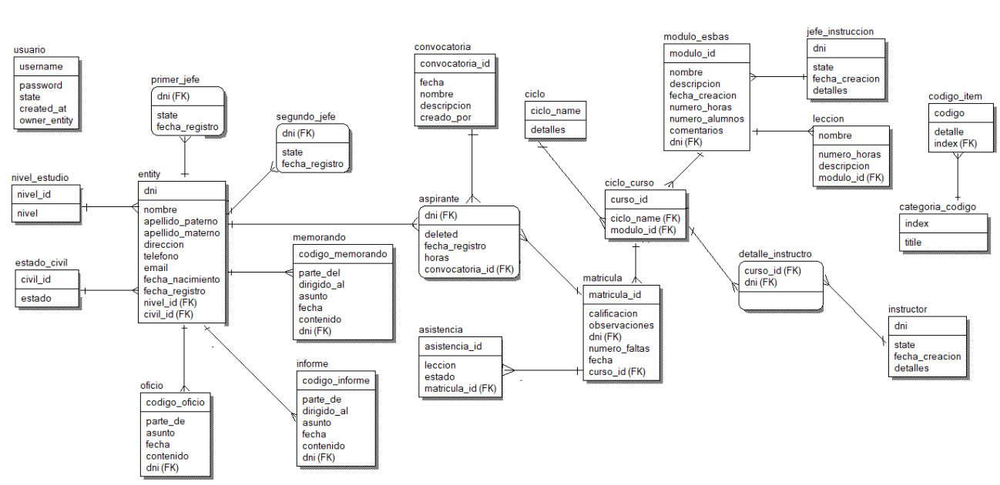

# API - Proyecto universitario desarrollado para la implementación de un sistema de gestión en los bomberos de Guadalupe -  La Libertad -  Perú.
- APP Flutter: https://github.com/User0608/zeus_project_app
- APP Web: https://github.com/User0608/zeus_project_web

Esta investigación se desarrolló para ayudar a la agilización de los procesos de la compañía de bomberos
Nuestra Señora de Guadalupe B-128, dichos procesos tienen involucrados parte administrativa y operativa
de la compañía; a toda la problemática encontrada se le brindo una solución mediante el desarrollo de la
tesis para la obtención del título profesional.
La investigación estableció una solución mediante la creación de un sistema web y móvil, incluso las
herramientas tecnológicas que se usaron para su desarrollo son las que estuvieron teniendo un auge dentro
de las tecnologías creadas para el desarrollo de proyectos basados en web y móvil. Es por ello que pongo
mi presente investigación a disposición de ustedes.
La tesis titulada “SISTEMA WEB PARA LA GESTIÓN ADMINISTRATIVA Y OPERATIVA DE LOS
BOMBEROS DE LA COMPAÑÍA NUESTRA SEÑORA DE GUADALUPE B-128” colaboró con el personal
que labora en la compañía en la agilización administrativa y apoyó a conseguir información para brindar un
mejor servicio, adicionalmente servirá como futura investigación para nuevos proyectos informáticos que
tomen como base la información recopilada.

## Diagrama Base de datos

